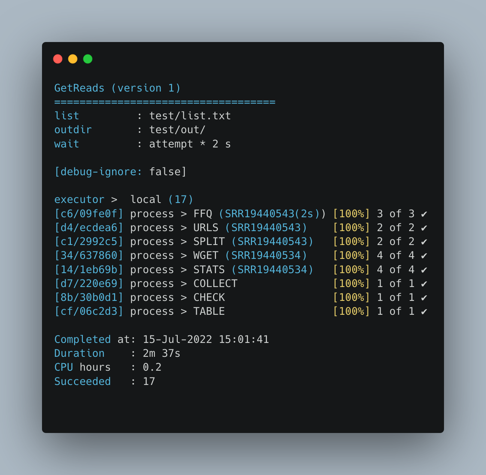

# :arrow_down: getreads (aka *ffq-sake*)

[](https://github.com/telatin/getreads/actions/workflows/ci.yaml)

A minimal pipeline to download FASTQ files from SRA given
a list of accession IDs.

## :magic_wand: Usage

```bash
nextflow run andreatelatin/getreads -p docker --list list.txt --outdir sra
```

Where:

* `--list "list.txt"` is a list of SRA accession IDs in simple text format
* `--outdir "name"` is the name of the output directory
* `--wait INT` is the number of seconds to wait after running _ffq_ [default: 2]

* `-profile docker` will used Docker for dependencies. An easy alternative is to create a conda environment using `deps/env.yaml`. Singularity is supported but untested (usually clusters with singularity are offline anyway)
  
## :open_file_folder: Output

The output directory contains:

* :file_folder: **json** (JSON file, one for each accession)
* :file_folder: **urls** (text files with the download URIs)
* :file_folder: **reads** (FASTQ.gz files, a set per accession)
* :spiral_notepad: **stats.txt** (reads statistics)
* :spiral_notepad: **check.txt** (a report of number of files per ID downloaded, with control of number of reads per file being equal)
* :chart: **table.tsv** metadata table from JSON files (only for samples where _ffq_ didn't fail) (_new in 2.0_)

## Alternatives

**[nf-core/fetchngs :star:](https://github.com/nf-core/fetchngs/)** is a fully-featured
pipeline to download reads and associated metadata. It's a fantastic and regularly
update tool.
Since sometimes it failed for me for reasons related to its complexity,
I made this minimal pipeline as a backup plan.

## Uses

* [ffq](https://github.com/pachterlab/ffq) to fetch URLs given the accessions, wrapped in _ffq-sake.py_ that retries if NCBI responds with "too many requests", but gracefully fails on 400 error.
* [wget](https://github.com/mirror/wget) to download the reads
* [seqfu](https://github.com/telatin/seqfu2) to collect stats

## Screenshot



* [Notes](test/README.md)
* [Releases](docs/RELEASES.md)


## Cite

If you use this pipeline, please cite:

* Gálvez-Merchán, Á., et al. (2022). *Metadata retrieval from sequence databases with ffq*. bioRxiv 2022.05.18.492548.
* Telatin, A., et al. (2020). *SeqFu: A Suite of Utilities for the Robust and Reproducible Manipulation of Sequence File*s. Bioengineering 2021, 8, 59. [10.3390/bioengineering8050059](https://doi.org/10.3390/bioengineering8050059)

